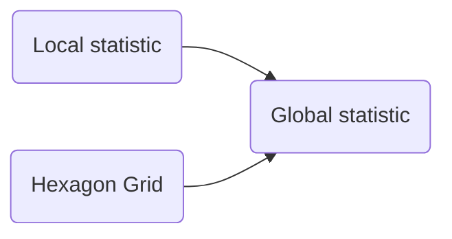

# Notes

1. Hotspot terminilogy
> Local statistic
> with actual map stats for the hex area / allocated as hotspot
> 5km is far too big

> Global statistic 
>

2. PoI data
   1. > 5km is far too big
   2. OpenStreetMap
   3. 
3. Geolocation data

