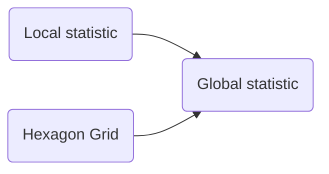

# Notes

1. Hotspot terminilogy
> Local statistic
> with actual map stats for the hex area / allocated as hotspot
> 5km is far too big
>
> Global statistic 

1. Localise hotspot
   1. Hexagon Grid
   2. the chinese paper
   3. 

2. PoI data
   1. > 5km is far too big
   2. OpenStreetMap
   3. 
3. Geolocation data

Notes:
1. URBAN area analysis 150m rad hexagon grid
2. building envirinment as a quantifiable data
3. 